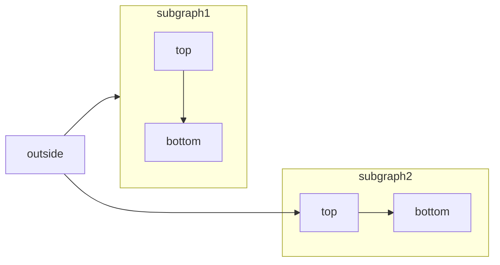
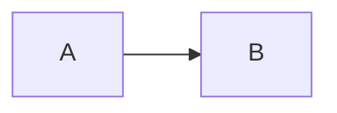

# Accordions and more

# Accordions

> Use accordions to show and hide content.

Accordions allow users to expand and collapse content sections. Use accordions for progressive disclosure and to organize information.

## ​Single accordion

I am an Accordion.

You can put any content in here, including other components, like code:HelloWorld.java

```
class HelloWorld {
     public static void main(String[] args) {
         System.out.println("Hello, World!");
     }
 }
```

 Accordion example

```
<Accordion title="I am an Accordion.">
  You can put any content in here, including other components, like code:

   ```java HelloWorld.java
    class HelloWorld {
        public static void main(String[] args) {
            System.out.println("Hello, World!");
        }
    }
  ```
</Accordion>
```

## ​Accordion Groups

 Group related accordions together using `<AccordionGroup>`. This creates a cohesive section of accordions that can be individually expanded or collapsed.

Getting started

You can put other components inside Accordions.HelloWorld.java

```
class HelloWorld {
    public static void main(String[] args) {
        System.out.println("Hello, World!");
    }
}
```

Advanced features

Add icons to make accordions more visually distinct and scannable.

Troubleshooting

Keep related content organized into groups. Accordion Group Example

```
<AccordionGroup>
  <Accordion title="Getting started">
    You can put other components inside Accordions.

    ```java HelloWorld.java
    class HelloWorld {
        public static void main(String[] args) {
            System.out.println("Hello, World!");
        }
    }
    ```
  </Accordion>

  <Accordion title="Advanced features" icon="alien-8bit">
    Add icons to make accordions more visually distinct and scannable.
  </Accordion>

  <Accordion title="Troubleshooting">
    Keep related content organized into groups.
  </Accordion>
</AccordionGroup>
```

## ​Properties

 [​](#param-title)titlestringrequiredTitle in the Accordion preview. [​](#param-description)descriptionstringDetail below the title in the Accordion preview. [​](#param-default-open)defaultOpenbooleandefault:"false"Whether the Accordion is open by default. [​](#param-icon)iconstringThe icon to display.Options:

- [Font Awesome](https://fontawesome.com/icons) icon name, if you have the `icons.library` [property](https://mintlify.com/docs/organize/settings#param-icons) set to `fontawesome` in your `docs.json`
- [Lucide](https://lucide.dev/icons) icon name, if you have the `icons.library` [property](https://mintlify.com/docs/organize/settings#param-icons) set to `lucide` in your `docs.json`
- URL to an externally hosted icon
- Path to an icon file in your project
- SVG code wrapped in curly braces

For custom SVG icons:

1. Convert your SVG using the [SVGR converter](https://react-svgr.com/playground/).
2. Paste your SVG code into the SVG input field.
3. Copy the complete `<svg>...</svg>` element from the JSX output field.
4. Wrap the JSX-compatible SVG code in curly braces: `icon={<svg ...> ... </svg>}`.
5. Adjust `height` and `width` as needed.

 [​](#param-icon-type)iconTypestringThe [Font Awesome](https://fontawesome.com/icons) icon style. Only used with Font Awesome icons.Options: `regular`, `solid`, `light`, `thin`, `sharp-solid`, `duotone`, `brands`.

---

# Badge

> Use badges to highlight status, labels, or metadata inline or standalone.

Use badges to display status indicators, labels, or metadata. Badges can be used inline within text or as standalone elements.

## ​Basic badge

 Badge

```
<Badge>Badge</Badge>
```

## ​Colors

 Badges support multiple color variants to convey different meanings. Badge Badge Badge Badge Badge Badge Badge Badge Badge Badge Badge

```
<Badge color="gray">Badge</Badge>
<Badge color="blue">Badge</Badge>
<Badge color="green">Badge</Badge>
<Badge color="yellow">Badge</Badge>
<Badge color="orange">Badge</Badge>
<Badge color="red">Badge</Badge>
<Badge color="purple">Badge</Badge>
<Badge color="white">Badge</Badge>
<Badge color="surface">Badge</Badge>
<Badge color="white-destructive">Badge</Badge>
<Badge color="surface-destructive">Badge</Badge>
```

## ​Sizes

 Badges come in four sizes to match your content hierarchy. Badge Badge Badge Badge

```
<Badge size="xs">Badge</Badge>
<Badge size="sm">Badge</Badge>
<Badge size="md">Badge</Badge>
<Badge size="lg">Badge</Badge>
```

## ​Shapes

 Choose between rounded corners or pill-shaped badges. Badge Badge

```
<Badge shape="rounded">Badge</Badge>
<Badge shape="pill">Badge</Badge>
```

## ​Icons

 Add icons to badges for additional context. Badge Badge Badge

```
<Badge icon="circle-check" color="green">Badge</Badge>
<Badge icon="clock" color="orange">Badge</Badge>
<Badge icon="ban" color="red">Badge</Badge>
```

## ​Stroke variant

 Use the stroke variant for a more subtle appearance. Badge Badge Badge Badge

```
<Badge stroke color="blue">Badge</Badge>
<Badge stroke color="green">Badge</Badge>
<Badge stroke color="orange">Badge</Badge>
<Badge stroke color="red">Badge</Badge>
```

## ​Disabled state

 Disable badges to indicate inactive or unavailable states. Badge Badge

```
<Badge disabled icon="lock" color="gray">Badge</Badge>
<Badge disabled icon="lock" color="blue">Badge</Badge>
```

## ​Inline usage

 Badges work naturally within text content. For example, this feature requires a Premium subscription, or this API endpoint returns JSON format.

```
This feature requires a <Badge color="orange" size="sm">Premium</Badge> subscription.
```

## ​Combined properties

 Combine multiple properties for custom badge styles. Premium Verified Beta

```
<Badge icon="star" color="blue" size="lg" shape="pill">Premium</Badge>
<Badge icon="check" stroke color="green" size="sm">Verified</Badge>
<Badge icon="badge-alert" color="orange" shape="rounded">Beta</Badge>
```

## ​Properties

 [​](#param-color)colorstringdefault:"gray"Badge color variant.Options: `gray`, `blue`, `green`, `yellow`, `orange`, `red`,
`purple`, `white`, `surface`, `white-destructive`, `surface-destructive`. [​](#param-size)sizestringdefault:"md"Badge size.Options: `xs`, `sm`, `md`, `lg`. [​](#param-shape)shapestringdefault:"rounded"Badge shape.Options: `rounded`, `pill`. [​](#param-icon)iconstringThe icon to display.Options:

- [Font Awesome](https://fontawesome.com/icons) icon name, if you have the `icons.library` [property](https://mintlify.com/docs/organize/settings#param-icons) set to `fontawesome` in your `docs.json`
- [Lucide](https://lucide.dev/icons) icon name, if you have the `icons.library` [property](https://mintlify.com/docs/organize/settings#param-icons) set to `lucide` in your `docs.json`
- URL to an externally hosted icon
- Path to an icon file in your project
- SVG code wrapped in curly braces

For custom SVG icons:

1. Convert your SVG using the [SVGR converter](https://react-svgr.com/playground/).
2. Paste your SVG code into the SVG input field.
3. Copy the complete `<svg>...</svg>` element from the JSX output field.
4. Wrap the JSX-compatible SVG code in curly braces: `icon={<svg ...> ... </svg>}`.
5. Adjust `height` and `width` as needed.

 [​](#param-icon-type)iconTypestringThe [Font Awesome](https://fontawesome.com/icons) icon style. Only used with Font Awesome icons.Options: `regular`, `solid`, `light`, `thin`, `sharp-solid`, `duotone`, `brands`. [​](#param-stroke)strokebooleandefault:"false"Display badge with an outline instead of filled background. [​](#param-disabled)disabledbooleandefault:"false"Display badge in a disabled state with reduced opacity. [​](#param-class-name)classNamestringAdditional CSS classes to apply to the badge.

---

# Banner

> Add a banner to display important site-wide announcements and notifications.

Use banners to display important announcements, updates, or notifications across your entire documentation site. Banners appear at the top of every page, support Markdown formatting, and can be made dismissible. Banners use the color defined by the `colors.dark` property in your `docs.json`. To add a banner, use the `banner` property in your `docs.json`:

```
"banner": {
  "content": "🚀 Version 2.0 is now live! See our [changelog](/changelog) for details.",
  "dismissible": true
}
```

## ​Properties

 [​](#param-content)contentstringrequiredThe banner message. Supports plain text and Markdown formatting. [​](#param-dismissible)dismissiblebooleanWhether users can dismiss the banner. When `true`, users can close the banner and it won’t reappear for their session. Defaults to `false`.

## ​Language-specific banners

 Configure different banner content for each language in your documentation. Define language-specific banners in the `navigation.languages` array in your `docs.json`.

```
{
  "navigation": {
    "languages": [
      {
        "language": "en",
        "banner": {
          "content": "🚀 Version 2.0 is now live! See our [changelog](/en/changelog) for details.",
          "dismissible": true
        },
        "groups": [
          {
            "group": "Getting started",
            "pages": ["en/overview", "en/quickstart"]
          }
        ]
      },
      {
        "language": "es",
        "banner": {
          "content": "🚀 ¡La versión 2.0 ya está disponible! Consulta nuestro [registro de cambios](/es/changelog) para más detalles.",
          "dismissible": true
        },
        "groups": [
          {
            "group": "Getting started",
            "pages": ["es/overview", "es/quickstart"]
          }
        ]
      }
    ]
  },
  "banner": {
    "content": "🚀 Version 2.0 is now live!",
    "dismissible": true
  }
}
```

### ​Fallback behavior

 Banners follow a priority order when determining which content to display:

1. **Language-specific banner**: If the current language has a `banner` configuration, it takes priority.
2. **Global banner**: If no language-specific banner exists, display the global `banner`.

---

# Callouts

> Use callouts to style and emphasize important content.

Callouts can be styled as a Note, Warning, Info, Tip, Check, Danger, or create your own callout: This adds a note in the content

```
<Note>This adds a note in the content</Note>
```

 This raises a warning to watch out for

```
<Warning>This raises a warning to watch out for</Warning>
```

 This draws attention to important information

```
<Info>This draws attention to important information</Info>
```

 This suggests a helpful tip

```
<Tip>This suggests a helpful tip</Tip>
```

 This brings us a checked status

```
<Check>This brings us a checked status</Check>
```

 This is a danger callout

```
<Danger>This is a danger callout</Danger>
```

  This is a custom callout

```
<Callout icon="key" color="#FFC107" iconType="regular">This is a custom callout</Callout>
```

---

# Cards

> Highlight main points or links with customizable layouts and icons.

Use cards to create visual containers for content. Cards are flexible containers that can include text, icons, images, and links.

## ​Basic card

 [Card titleThis is how you use a card with an icon and a link. Clicking on this card
brings you to the Columns page.](https://mintlify.com/docs/components/columns) Card example

```
<Card title="Card title" icon="text-align-start" href="/components/columns">
  This is how you use a card with an icon and a link. Clicking on this card
  brings you to the Columns page.
</Card>
```

## ​Card variations

 Cards support several layout and styling options to fit different content needs.

### ​Horizontal layout

 Add the `horizontal` property to display cards in a more compact, horizontal layout.

## Horizontal card

This is an example of a horizontal card. Horizontal card example

```
<Card title="Horizontal card" icon="text-align-start" horizontal>
  This is an example of a horizontal card.
</Card>
```

### ​Image cards

 Add an `img` property to display an image at the top of the card. 

## Image card

This is an example of a card with an image. Image card example

```
<Card title="Image card" img="/images/card-with-image.png">
  This is an example of a card with an image.
</Card>
```

### ​Link cards with custom CTAs

 You can customize the call-to-action text and control whether an arrow appears. By default, arrows only show for external links. [Link cardThis is an example of a card with an icon and a link. Clicking on this card brings you to the Columns page.](https://mintlify.com/docs/components/columns) Link card example

```
<Card
  title="Link card"
  icon="link"
  href="/components/columns"
  arrow="true"
  cta="Click here"
>
  This is an example of a card with an icon and a link. Clicking on this card brings you to the Columns page.
</Card>
```

## ​Group cards

 Use the [Columns component](https://mintlify.com/docs/components/columns) to organize multiple cards side by side. The Columns component supports one to four columns and automatically adjusts for smaller screens.

## First card

This is the first card.

## Second card

This is the second card. Columns example

```
<Columns cols={2}>
  <Card title="First card" icon="panel-left-close">
    This is the first card.
  </Card>
  <Card title="Second card" icon="panel-right-close">
    This is the second card.
  </Card>
</Columns>
```

## ​Properties

 [​](#param-title)titlestringrequiredThe title displayed on the card [​](#param-icon)iconstringThe icon to display.Options:

- [Font Awesome](https://fontawesome.com/icons) icon name, if you have the `icons.library` [property](https://mintlify.com/docs/organize/settings#param-icons) set to `fontawesome` in your `docs.json`
- [Lucide](https://lucide.dev/icons) icon name, if you have the `icons.library` [property](https://mintlify.com/docs/organize/settings#param-icons) set to `lucide` in your `docs.json`
- URL to an externally hosted icon
- Path to an icon file in your project
- SVG code wrapped in curly braces

For custom SVG icons:

1. Convert your SVG using the [SVGR converter](https://react-svgr.com/playground/).
2. Paste your SVG code into the SVG input field.
3. Copy the complete `<svg>...</svg>` element from the JSX output field.
4. Wrap the JSX-compatible SVG code in curly braces: `icon={<svg ...> ... </svg>}`.
5. Adjust `height` and `width` as needed.

 [​](#param-icon-type)iconTypestringThe [Font Awesome](https://fontawesome.com/icons) icon style. Only used with Font Awesome icons.Options: `regular`, `solid`, `light`, `thin`, `sharp-solid`, `duotone`, `brands`. [​](#param-color)colorstringIcon color as a hex code (for example, `#FF6B6B`). [​](#param-href)hrefstringURL to navigate to when the card is clicked. [​](#param-horizontal)horizontalbooleanDisplay the card in a compact horizontal layout. [​](#param-img)imgstringURL or local path to an image displayed at the top of the card. [​](#param-cta)ctastringCustom text for the action button. [​](#param-arrow)arrowbooleanShow or hide the link arrow icon.

---

# Code groups

> Display multiple code examples in one component

Use the `CodeGroup` component to display multiple code blocks in a tabbed interface, allowing users to compare implementations across different programming languages or see alternative approaches for the same task.

```
console.log("Hello World");
```

 Code groups inherit global styling from your `docs.json` file. Customize your theme using `styling.codeblocks`. See [Settings](https://mintlify.com/docs/organize/settings#styling) for configuration options. Code groups automatically synchronize with other code groups and [tabs](https://mintlify.com/docs/components/tabs) on the same page when their labels match. When you select a language in one code group, all tabs and code groups with matching labels update to show the same language.

## ​Create code groups

 To create a code group, wrap multiple code blocks with `<CodeGroup>` tags. Each code block must include a title, which becomes the tab label.

```
<CodeGroup>

```javascript helloWorld.js
console.log("Hello World");
```

```python hello_world.py
print('Hello World!')
```

```java HelloWorld.java
class HelloWorld {
    public static void main(String[] args) {
        System.out.println("Hello, World!");
    }
}
```

</CodeGroup>
```

## ​Language dropdown

 You can replace the tabs in a code group with a dropdown menu to toggle between languages using the `dropdown` prop. helloWorld.js

```
console.log("Hello World");
```

```
<CodeGroup dropdown>

```javascript helloWorld.js
console.log("Hello World");
```

```python hello_world.py
print('Hello World!')
```

```java HelloWorld.java
class HelloWorld {
    public static void main(String[] args) {
        System.out.println("Hello, World!");
    }
}
```
</CodeGroup>
```

---

# Color

> Display color palettes with click-to-copy functionality.

Use the Color component to showcase color palettes in your documentation. Colors can be displayed in a compact grid or organized in a table with labeled rows.

## ​Compact variant

 Display colors in a simple grid layout with color names and values.

blue-500

#3B82F6

blue-600

#2563EB

blue-700

#1D4ED8

blue-800

#1E40AF

 Compact example

```
<Color variant="compact">
  <Color.Item name="blue-500" value="#3B82F6" />
  <Color.Item name="blue-600" value="#2563EB" />
  <Color.Item name="blue-700" value="#1D4ED8" />
  <Color.Item name="blue-800" value="#1E40AF" />
</Color>
```

## ​Table variant

 Organize colors into labeled rows for design system documentation.

Primary

Secondary

 Table example

```
<Color variant="table">
  <Color.Row title="Primary">
    <Color.Item name="primary-500" value="#3B82F6" />
    <Color.Item name="primary-600" value="#2563EB" />
    <Color.Item name="primary-700" value="#1D4ED8" />
  </Color.Row>
  <Color.Row title="Secondary">
    <Color.Item name="secondary-500" value="#8B5CF6" />
    <Color.Item name="secondary-600" value="#7C3AED" />
  </Color.Row>
</Color>
```

## ​Color formats

 The component supports all CSS color formats including hex, rgb, rgba, hsl, and oklch.

hex

#FF5733

rgb

rgb(51, 255, 87)

rgba

rgba(51, 87, 255, 0.7)

hsl

hsl(180, 70%, 55%)

oklch

oklch(70% 0.2 145)

 Color formats example

```
<Color variant="compact">
  <Color.Item name="hex" value="#FF5733" />
  <Color.Item name="rgb" value="rgb(51, 255, 87)" />
  <Color.Item name="rgba" value="rgba(51, 87, 255, 0.7)" />
  <Color.Item name="hsl" value="hsl(180, 70%, 55%)" />
  <Color.Item name="oklch" value="oklch(70% 0.2 145)" />
</Color>
```

## ​Theme-aware colors

 Define different colors for light and dark modes using an object with `light` and `dark` properties.

bg-primary

#FFFFFF

bg-secondary

#F9FAFB

text-primary

#111827

 Theme-aware example

```
<Color variant="compact">
  <Color.Item name="bg-primary" value={{ light: "#FFFFFF", dark: "#000000" }} />
  <Color.Item name="bg-secondary" value={{ light: "#F9FAFB", dark: "#0A0A0A" }} />
  <Color.Item name="text-primary" value={{ light: "#111827", dark: "#F9FAFB" }} />
</Color>
```

## ​Properties

### ​Color

 [​](#param-variant)variantstringrequiredDisplay style for the color palette. Options: `compact` or `table`. [​](#param-children)childrenColor.Item | Color.RowrequiredColor items or rows to display.

### ​Color.Row

 [​](#param-title)titlestringLabel for the row of colors. [​](#param-children-1)childrenColor.ItemrequiredColor items to display in the row.

### ​Color.Item

 [​](#param-name)namestringName or label for the color. [​](#param-value)valuestring | { light: string, dark: string }requiredColor value in any CSS format, or an object with light and dark mode values.

---

# Columns

> Show elements side by side

The `Columns` component lets you group multiple `Card` components together. It’s most often used to put cards in a grid, by specifying the number of grid columns. Columns are responsive and automatically adjust for smaller screens.

## Get started

Set up your project with our quickstart guide.

## API reference

Explore endpoints, parameters, and examples for your API. Columns example

```
<Columns cols={2}>
  <Card title="Get started">
    Set up your project with our quickstart guide.
  </Card>
  <Card title="API reference">
    Explore endpoints, parameters, and examples for your API.
  </Card>
</Columns>
```

## ​Properties

 [​](#param-cols)colsnumberdefault:2The number of columns per row. Accepts values from 1 to 4.

---

# Examples

> Display code blocks in the right sidebar on desktop devices

The `<RequestExample>` and `<ResponseExample>` components display code blocks in the right sidebar to create a two-column layout that keeps examples visible while users scroll through your content. These components are designed for API documentation, but they work on all pages. Common use cases:

- API endpoint documentation with request and response examples
- Configuration examples alongside explanatory text
- Code samples that users reference while following instructions
- Before and after examples in tutorials

 On mobile devices, `<RequestExample>` and `<ResponseExample>` components display as regular code blocks and can be scrolled past.

## ​RequestExample

 Use `<RequestExample>` to pins code examples in the right sidebar. This component works similarly to the [CodeGroup](https://mintlify.com/docs/components/code-groups) component, but displays the code in the sidebar instead of inline. You can include multiple code blocks inside a single `<RequestExample>`. Each code block must have a title attribute. RequestExample

```
<RequestExample>

```bash Request
curl --request POST \
  --url https://dog-api.kinduff.com/api/facts
```

</RequestExample>
```

## ​ResponseExample

 The `<ResponseExample>` component pins code examples in the right sidebar beneath any `<RequestExample>` content on the same page. ResponseExample

```
<ResponseExample>

```json Response
{ "status": "success" }
```

</ResponseExample>
```

---

# Expandables

> Toggle to display nested properties

Use expandables to show and hide nested content within response fields. Expandables are particularly useful for displaying complex object properties in API documentation. [​](#param-user)userUser Object

Show properties

[​](#param-full-name)full_namestringThe full name of the user[​](#param-is-over-21)is_over_21booleanWhether the user is over 21 years old Expandable example

```
<ResponseField name="user" type="User Object">
  <Expandable title="properties">
    <ResponseField name="full_name" type="string">
      The full name of the user
    </ResponseField>

    <ResponseField name="is_over_21" type="boolean">
      Whether the user is over 21 years old
    </ResponseField>
  </Expandable>
</ResponseField>
```

## ​Properties

 [​](#param-title)titlestringThe name of the object you are showing. [​](#param-default-open)defaultOpenbooleandefault:"false"Set to `true` for the expandable to open when the page loads

---

# Fields

> Document API request and response parameters with type information.

Use fields to document API parameters and responses. There are two types of fields: parameter fields and response fields.

## ​Parameter field

 The `<ParamField>` component is used to define parameters for your APIs or SDKs. Adding a `ParamField` automatically adds an [API Playground](https://mintlify.com/docs/api-playground/overview). [​](#param-param)paramstringrequiredAn example of a parameter field

```
<ParamField path="param" type="string" required>
  An example of a parameter field
</ParamField>
```

### ​Properties

 [​](#param-query-path-body-or-header)query, path, body, or headerstringWhether the parameter is a query, path, body, or header. Followed by the
parameter name. [​](#param-type)typestringExpected type of the parameter’s value.Supports `number`, `string`, `boolean`, `object`.Arrays can be defined using the `[]` suffix. For example `string[]`. [​](#param-required)requiredbooleanIndicate whether the parameter is required. [​](#param-deprecated)deprecatedbooleanIndicate whether the parameter is deprecated. [​](#param-default)defaultanyDefault value populated when the request value is empty [​](#param-placeholder)placeholderstringPlaceholder text for the input in the playground. [​](#param-children)childrenstringDescription of the parameter (Markdown-enabled).

## ​Response field

 The `<ResponseField>` component defines the return values of an API. [​](#param-response)responsestringrequiredAn example of a response field

```
<ResponseField name="response" type="string" required>
  A response field example
</ResponseField>
```

### ​Properties

 [​](#param-name)namestringrequiredThe name of the response value. [​](#param-type-1)typestringrequiredExpected type of the response value. This can be any arbitrary string. [​](#param-default-1)defaultstringThe default value. [​](#param-required-1)requiredbooleanIndicate whether the response is required. [​](#param-deprecated-1)deprecatedbooleanWhether a field is deprecated. [​](#param-pre)prestring[]Labels that are shown before the name of the field. [​](#param-post)poststring[]Labels that are shown after the name of the field.

---

# Frames

> Add visual emphasis with styled frames around images and other components.

Use frames to display images, diagrams, or other visual content with consistent styling and optional captions. Frames center content and provide visual separation from surrounding text. 

## ​Captions

 Add additional context to an image using the optional `caption` prop. Captions appear in the frame below the image. 

Yosemite National Park is visited by over 3.5 million people every year.

### ​Markdown in captions

 Captions support markdown formatting, including links and bold text. 

Learn more about [Yosemite National Park](https://www.nps.gov/yose/index.htm) and plan your visit.

 

Important: Check the [park website](https://www.nps.gov/yose/index.htm) for current conditions.

## ​Hints

 Add text that precedes the frame using the optional `hint` prop. Hints appear above the frame.

If you plan to visit Yosemite National Park, secure your permits before you go.


Yosemite National Park is visited by over 3.5 million people every year.

## ​Properties

 [​](#param-caption)captionstringText that appears as part of the frame, centered below the content. Supports markdown formatting including links and bold text. [​](#param-hint)hintstringText that precedes the frame.

```
<Frame>
  
</Frame>
```

---

# Icons

> Use icons from popular libraries, external URLs, or files in your project.

Use icons from Font Awesome, Lucide, SVGs, external URLs, or files in your project to enhance your documentation.  Icon example

```
<Icon icon="flag" size={32} />
```

## ​Inline icons

 Icons are placed inline when used within a sentence, paragraph, or heading.  Use icons for decoration or to add visual emphasis. Inline      example

```
Icons are placed inline when used within a sentence, paragraph, or heading. <Icon icon="flag" iconType="solid" /> Use icons for decoration or to add visual emphasis.
```

## ​Properties

 [​](#param-icon)iconstringrequiredThe icon to display.Options:

- [Font Awesome icon](https://fontawesome.com/icons) name, if you have the `icons.library` [property](https://mintlify.com/docs/organize/settings#param-icons) set to `fontawesome` in your `docs.json`
- [Lucide icon](https://lucide.dev/icons) name, if you have the `icons.library` [property](https://mintlify.com/docs/organize/settings#param-icons) set to `lucide` in your `docs.json`
- URL to an externally hosted icon
- Path to an icon file in your project

 [​](#param-icon-type)iconTypestringThe [Font Awesome](https://fontawesome.com/icons) icon style. Only used with Font Awesome icons.Options: `regular`, `solid`, `light`, `thin`, `sharp-solid`, `duotone`, `brands`. [​](#param-color)colorstringThe color of the icon as a hex code (for example, `#FF5733`). [​](#param-size)sizenumberThe size of the icon in pixels. [​](#param-class-name)classNamestringCustom CSS class name to apply to the icon.

---

# Mermaid

> Create flowcharts, diagrams, and visualizations with Mermaid syntax.

[Mermaid](https://mermaid.js.org/) lets you build flowcharts, sequence diagrams, Gantt charts, and other diagrams using text and code. For a complete list of supported diagram types and syntax, see the [Mermaid documentation](https://mermaid.js.org/intro/). Mermaid flowchart example

```

```

## ​Interactive controls

 All Mermaid diagrams include interactive zoom and pan controls. By default, controls appear when the diagram height exceeds 120px.

- **Zoom in/out**: Use the zoom buttons to increase or decrease the diagram scale.
- **Pan**: Use the directional arrows to move around the diagram.
- **Reset view**: Click the reset button to return to the original view.

 The controls are especially useful for large or complex diagrams that don’t fit entirely in the viewport.

## ​Properties

 [​](#param-actions)actionsbooleanShow or hide the interactive controls. When set, this overrides the default behavior (controls shown when diagram height exceeds 120px). [​](#param-placement)placementstringdefault:"bottom-right"Position of the interactive controls. Options: `top-left`, `top-right`, `bottom-left`, `bottom-right`.

### ​Examples

 Hide controls on a diagram:

```

```

 Show controls in the top-left corner:

```

```

 Combine both properties:

```

```

## ​Syntax

 To create a Mermaid diagram, write your diagram definition inside a Mermaid code block.

```
```mermaid
// Your mermaid diagram code here
```
```

---

# Panel

> Customize the content of the right side panel on a page.

You can use the `<Panel>` component to customize the right side panel of a page with any components that you want. If a page has a `<Panel>` component, any [RequestExample](https://mintlify.com/docs/components/examples#request-example) and [ResponseExample](https://mintlify.com/docs/components/examples#response-example) components must be inside `<Panel>`. The components in a `<Panel>` will replace a page’s table of contents.

```
<Panel>
  <Info>Pin info to the side panel. Or add any other component.</Info>
</Panel>
```

---

# Response fields

> Display API response values.

The `<ResponseField>` component is designed to define the return values of an API. Many docs also use `<ResponseField>` on pages when you need to list the types of something. [​](#param-response)responsestringrequiredA response field example

```
<ResponseField name="response" type="string" required>
  A response field example
</ResponseField>
```

## ​Props

 [​](#param-name)namestringrequiredThe name of the response value. [​](#param-type)typestringrequiredExpected type of the response value - this can be any arbitrary string. [​](#param-default)defaultstringThe default value. [​](#param-required)requiredbooleanShow “required” beside the field name. [​](#param-deprecated)deprecatedbooleanWhether a field is deprecated or not. [​](#param-pre)prestring[]Labels that are shown before the name of the field [​](#param-post)poststring[]Labels that are shown after the name of the field

---

# Steps

> Create numbered step-by-step procedures.

Use steps to display a series of sequential actions or events. You can add as many steps as needed. 1

First Step

These are instructions or content that only pertain to the first step.2

Second Step

These are instructions or content that only pertain to the second step.3

Third Step

These are instructions or content that only pertain to the third step. Steps example

```
<Steps>
  <Step title="First Step">
    These are instructions or content that only pertain to the first step.
  </Step>
  <Step title="Second Step">
    These are instructions or content that only pertain to the second step.
  </Step>
  <Step title="Third Step">
    These are instructions or content that only pertain to the third step.
  </Step>
</Steps>
```

## ​Steps properties

 [​](#param-children)childrenReactElement<StepProps>[]requiredA list of `Step` components. [​](#param-title-size)titleSizestringdefault:"p"The size of the step titles. One of `p`, `h2`, and `h3`.

## ​Individual step properties

 [​](#param-children-1)childrenstring | ReactNoderequiredThe content of a step either as plain text or components. [​](#param-icon)iconstringThe icon to display.Options:

- [Font Awesome](https://fontawesome.com/icons) icon name, if you have the `icons.library` [property](https://mintlify.com/docs/organize/settings#param-icons) set to `fontawesome` in your `docs.json`
- [Lucide](https://lucide.dev/icons) icon name, if you have the `icons.library` [property](https://mintlify.com/docs/organize/settings#param-icons) set to `lucide` in your `docs.json`
- URL to an externally hosted icon
- Path to an icon file in your project
- SVG code wrapped in curly braces

For custom SVG icons:

1. Convert your SVG using the [SVGR converter](https://react-svgr.com/playground/).
2. Paste your SVG code into the SVG input field.
3. Copy the complete `<svg>...</svg>` element from the JSX output field.
4. Wrap the JSX-compatible SVG code in curly braces: `icon={<svg ...> ... </svg>}`.
5. Adjust `height` and `width` as needed.

 [​](#param-icon-type)iconTypestringThe [Font Awesome](https://fontawesome.com/icons) icon style. Only used with Font Awesome icons.Options: `regular`, `solid`, `light`, `thin`, `sharp-solid`, `duotone`, `brands`. [​](#param-title)titlestringThe title is the primary text for the step and shows up next to the indicator. [​](#param-step-number)stepNumbernumberThe number of the step. [​](#param-title-size-1)titleSizestringdefault:"p"The size of the step titles. One of `p`, `h2`, and `h3`.

---

# Tabs

> Organize content with tabs to show different options or versions.

Use tabs to organize content into multiple panels that users can switch between. You can add any number of tabs and include other components inside each tab.

- First tab
- Second tab
- Third tab

☝️ Welcome to the content that you can only see inside the first tab.You can add any number of components inside of tabs. For example, a code block:HelloWorld.java

```
class HelloWorld {
      public static void main(String[] args) {
          System.out.println("Hello, World!");
      }
  }
```

✌️ Here’s content that’s only inside the second tab.This one has a  icon!💪 Here’s content that’s only inside the third tab. Tabs example

```
<Tabs>
  <Tab title="First tab">
    ☝️ Welcome to the content that you can only see inside the first tab.

    You can add any number of components inside of tabs. For example, a code block:
    ```java HelloWorld.java
      class HelloWorld {
          public static void main(String[] args) {
              System.out.println("Hello, World!");
          }
      }
    ```
  </Tab>
  <Tab title="Second tab" icon="leaf">
    ✌️ Here's content that's only inside the second tab.

    This one has a <Icon icon="leaf" /> icon!
  </Tab>
  <Tab title="Third tab">
    💪 Here's content that's only inside the third tab.
  </Tab>
</Tabs>
```

 Tabs automatically synchronize with other tabs and [code groups](https://mintlify.com/docs/components/code-groups) on the same page when their labels match. When you select a tab, all other tabs and code groups with the same label update to match your selection.

## ​Properties

 [​](#param-title)titlestringrequiredThe title of the tab. Short titles are easier to navigate. Tabs with matching titles synchronize their selections. [​](#param-icon)iconstringA [Font Awesome](https://fontawesome.com/icons) icon, [Lucide](https://lucide.dev/icons) icon, URL to an icon, or relative path to an icon. [​](#param-icon-type)iconTypestringFor Font Awesome icons only: One of `regular`, `solid`, `light`, `thin`, `sharp-solid`, `duotone`, `brands`. [​](#param-border-bottom)borderBottombooleanAdds a bottom border and padding to the tabs container. Useful to visually separate tabbed content from the rest of the page, especially when tabs contain content of varying lengths.

---

# Tiles

> Display visual previews with titles and descriptions in a grid layout.

Use tiles to create visual showcase elements with a patterned background, title, and description. Tiles are ideal for displaying component previews, feature highlights, or navigation items in a grid layout. [AccordionTwo variants](https://mintlify.com/docs/components/accordions) Tile example

```
<Tile href="/components/accordions" title="Accordion" description="Two variants">
  
  
</Tile>
```

## ​Grid layout

 Combine tiles with the [columns component](https://mintlify.com/docs/components/columns) to create a responsive grid of visual previews. [AccordionTwo variants](https://mintlify.com/docs/components/accordions)[AccordionTwo variants](https://mintlify.com/docs/components/accordions)[AccordionTwo variants](https://mintlify.com/docs/components/accordions) Grid layout example

```
<Columns cols={3}>
  <Tile href="/components/accordions" title="Accordion" description="Two variants">
    
    
  </Tile>
  <Tile href="/components/accordions" title="Accordion" description="Two variants">
    
    
  </Tile>
  <Tile href="/components/accordions" title="Accordion" description="Two variants">
    
    
  </Tile>
</Columns>
```

## ​Properties

 [​](#param-href)hrefstringrequiredURL to navigate to when the tile is clicked. [​](#param-title)titlestringThe title displayed below the tile preview. [​](#param-description)descriptionstringA short description displayed below the title. [​](#param-children)childrenReact.ReactNoderequiredContent displayed inside the tile preview area, typically images or SVGs.

---

# Tooltips

> Add contextual help with hover tooltips for terms and concepts.

Use tooltips to provide additional context or definitions when a user hovers over a string of text. Tooltips can include optional call-to-action links. **Example**:  documentation helps developers understand how to integrate with your service. Tooltip example

```
<Tooltip headline="API" tip="Application Programming Interface: a set of protocols for software applications to communicate." cta="Read our API guide" href="/api-reference">API</Tooltip> documentation helps developers understand how to integrate with your service.
```

## ​Properties

 [​](#param-tip)tipstringrequiredThe text displayed in the tooltip. [​](#param-headline)headlinestringText displayed above the `tip` text. [​](#param-cta)ctastringThe call-to-action text for a link within the tooltip. [​](#param-href)hrefstringURL for the call-to-action link. Required when using `cta`.

---

# Tree

> Use tree components to display hierarchical file and folder structures.

Use tree components to display hierarchical structures like file systems, project directories, or nested content. The tree component supports keyboard navigation and accessibility features.

## ​Basic tree

 applayout.tsxpage.tsxglobal.csslibpackage.jsontsconfig.json Tree example

```
<Tree>
  <Tree.Folder name="app" defaultOpen>
    <Tree.File name="layout.tsx" />
    <Tree.File name="page.tsx" />
    <Tree.File name="global.css" />
  </Tree.Folder>
  <Tree.Folder name="lib">
    <Tree.File name="utils.ts" />
    <Tree.File name="db.ts" />
  </Tree.Folder>
  <Tree.File name="package.json" />
  <Tree.File name="tsconfig.json" />
</Tree>
```

## ​Nested folders

 Create deeply nested structures by nesting `Tree.Folder` components within each other. applayout.tsxpage.tsxapiauthroute.tscomponentspackage.json Nested folders example

```
<Tree>
  <Tree.Folder name="app" defaultOpen>
    <Tree.File name="layout.tsx" />
    <Tree.File name="page.tsx" />
    <Tree.Folder name="api" defaultOpen>
      <Tree.Folder name="auth">
        <Tree.File name="route.ts" />
      </Tree.Folder>
      <Tree.File name="route.ts" />
    </Tree.Folder>
    <Tree.Folder name="components">
      <Tree.File name="button.tsx" />
      <Tree.File name="dialog.tsx" />
      <Tree.File name="tabs.tsx" />
    </Tree.Folder>
  </Tree.Folder>
  <Tree.File name="package.json" />
</Tree>
```

## ​Keyboard navigation

 The tree component supports keyboard navigation.

- **Arrow keys**: Navigate up and down through visible items.
- **Right arrow**: Expand a closed folder or move to the first child of an open folder.
- **Left arrow**: Collapse an open folder or move to the parent folder.
- **Home**: Jump to the first item in the tree.
- **End**: Jump to the last visible item in the tree.
- **Enter/Space**: Toggle folder open/closed state.
- *****: Expand all sibling folders at the current level.
- **Type-ahead search**: Type characters to jump to items that start with those characters.

## ​Properties

### ​Tree.Folder

 [​](#param-name)namestringrequiredThe name of the folder displayed in the tree. [​](#param-default-open)defaultOpenbooleandefault:"false"Whether the folder is expanded by default. [​](#param-openable)openablebooleandefault:"true"Whether the folder can be opened and closed. Set to false for non-interactive folders.

### ​Tree.File

 [​](#param-name-1)namestringrequiredThe name of the file displayed in the tree.

---

# Update

> Display product updates and changelog entries in a timeline format.

Use the `Update` component to display changelog entries, version updates, and release notes with consistent formatting. [​](#example)Examplev0.1.1

## ​Example update

You can add anything here, like a screenshot, a code snippet, or a list of changes.

### ​Features

- Responsive design
- Anchor for each update
- Generated RSS feed entry for each update

## ​How to use

 Update example

```
<Update label="2024-10-11" description="v0.1.0" tags={["Mintlify"]}>
  This is an update with a label, description, and tag.
</Update>
```

 Use multiple `Update` components to create [changelogs](https://mintlify.com/docs/create/changelogs). Update components automatically generate RSS feed entries. The entries contain pure Markdown only—components, code blocks, inline code, and raw HTML elements are not included. If your update includes components or HTML, use the `rss` prop to provide alternative text for RSS subscribers. Custom RSS content

```
<Update
  label="March 2025"
  description="v2.0.0"
  rss={{
    title: "March 2025 - Major redesign",
    description: "Complete UI overhaul with new components"
  }}
>
  ## New dashboard

  <Frame>
    
  </Frame>

  Check out our redesigned dashboard with improved navigation.
</Update>
```

## ​Props

 [​](#param-label)labelstringrequiredLabel for the update. Appears to the left of the update and creates an anchor link. Labels should be unique. [​](#param-tags)tagsstring[]Tags for the update. Shown as filters in the right side panel. [​](#param-description)descriptionstringDescription of the update. Appears below the label and tag. [​](#param-rss)rssobjectUpdate components automatically generate RSS feed entries. Use the `rss` property to create a single RSS feed entry with a custom title and description.If not provided:

- Updates with Markdown headings create a separate RSS feed entry for each heading.
- Updates without Markdown headings create a single RSS feed entry using the `label` as the title.

Show properties

[​](#param-title)titlestringCustom title for the RSS feed entry.[​](#param-description-1)descriptionstringCustom description for the RSS feed entry.

---

# View

> Create multi-view content for different programming languages or frameworks.

Use the `View` component to create content that changes based on the selected view in a multi-view dropdown. This is particularly useful for showing code examples or documentation specific to different programming languages or frameworks. Use one view component per language per page. Use [tabs](https://mintlify.com/docs/components/tabs) for procedures that differ by language and [code groups](https://mintlify.com/docs/components/code-groups) for code examples that differ by language. This content is only visible when JavaScript is selected.

```
console.log("Hello from JavaScript!");
```

## ​Example

 JavaScript and Python views

```
<View title="JavaScript" icon="js">
  This content is only visible when JavaScript is selected.

  ```javascript
  console.log("Hello from JavaScript!");
  ```
</View>

<View title="Python" icon="python">
  This content is only visible when Python is selected.

  ```python
  print("Hello from Python!")
  ```
</View>
```

## ​Table of contents behavior

 The table of contents automatically updates to show only the headings for the currently selected view. When you switch between views using the multi-view dropdown, the table of contents refreshes to display the relevant headings for that view. If you have different heading structures in each view, users will only see the headings that are relevant to their selected language or framework.

## ​Properties

 [​](#param-title)titlestringrequiredThe title that identifies this view. Must match one of the options in the multi-view dropdown. [​](#param-icon)iconstringA [Font Awesome](https://fontawesome.com/icons) icon, [Lucide](https://lucide.dev/icons) icon, URL to an icon, or relative path to an icon. [​](#param-icon-type)iconTypestringFor Font Awesome icons only: One of `regular`, `solid`, `light`, `thin`, `sharp-solid`, `duotone`, `brands`.
